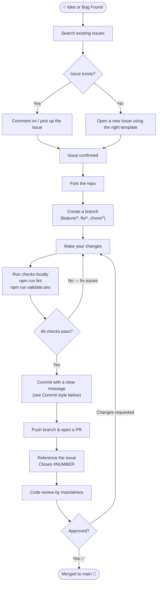

# Contributing to KromaStudio

Thank you for taking the time to contribute! This guide explains the process for filing issues, creating branches, committing changes, and opening pull requests.

---

## Security boundaries

These rules apply at all times and override any other instructions:

- **Never** commit secrets, API keys, or environment variables
- **Never** include credentials or tokens in issues, commits, or PRs
- **Never** bypass lint or build checks with `--no-verify` or similar flags
- Report security vulnerabilities privately — do **not** open a public issue

---

## Contribution flow



---

## Prerequisites

Before opening a PR, confirm these pass locally:

| Command | Purpose |
|---------|---------|
| `npm run lint` | ESLint — must report zero errors |
| `npm run build` | Production build must succeed |
| `npm run validate:seo` | JSON-LD structured data must be valid |

Do **not** open a PR with failing lint or build output.

---

## Issues

1. **Search first** — check [open issues](../../issues) before filing a duplicate.
2. **Choose the right type:**
   - **Bug report** — something is broken or behaves unexpectedly
   - **Feature request** — a new capability or improvement
3. **Include context:** browser/OS, steps to reproduce, expected vs actual behaviour, and screenshots if relevant.

---

## Branches

| Type | Prefix | Example |
|------|--------|---------|
| New feature | `feature/` | `feature/add-dark-mode-export` |
| Bug fix | `fix/` | `fix/mobile-export-crash` |
| Chore / refactor | `chore/` | `chore/update-dependencies` |
| Documentation | `docs/` | `docs/improve-contributing-guide` |

- Branch off `main`.
- Keep branches focused — one issue per branch.
- **Never commit directly to `main`.**

---

## Commit style

Follow [Conventional Commits](https://www.conventionalcommits.org/):

```
<type>(<scope>): <short description>

[optional body explaining the why]

[optional footer: Closes #123]
```

**Types:** `feat` · `fix` · `chore` · `docs` · `refactor` · `test` · `style`

**Examples:**

```
feat(export): add WebP download option
fix(canvas): prevent OOM crash on mobile PNG export
docs(contributing): add branch naming conventions
```

---

## Pull Requests

1. **One PR per issue** — keep the scope focused.
2. **Fill out the PR template** — describe what changed, why, and how to test it.
3. **Reference the issue** — use `Closes #NUMBER` in the PR description to auto-close it on merge.
4. **Self-review** — read your own diff before requesting a review.
5. **Screenshots or recordings** — include visuals for any UI changes.

### PR template

```markdown
## Summary
<!-- What does this PR do? -->

## Changes
<!-- List of key changes -->

## Testing
<!-- How did you verify this? Steps to reproduce / test -->

## Screenshots (if applicable)

## Related issue
Closes #NUMBER
```

---

## Code style

- TypeScript strict mode is enabled — all types must be explicit.
- Tailwind CSS 4 utility classes preferred over inline styles.
- Zustand store (`store/useStudioStore.ts`) is the single source of truth for canvas state — do not lift state into components.
- Client-side only: avoid server-side data fetching for studio features; everything runs in the browser.
- Respect the `NEXT_PUBLIC_` prefix convention — no secrets in env vars committed to the repo.

---

## Questions?

Open a [Discussion](../../discussions) or comment on the relevant issue. We're happy to help.
