<div align="center">
  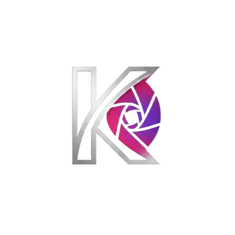

  # KromaStudio

  *Turn plain code and ideas into scroll-stopping visuals*

  [](https://nextjs.org)
  [](https://react.dev)
  [](https://www.typescriptlang.org)
  [](https://tailwindcss.com)
  [](LICENSE)

  [Live site](https://www.kromastudio.in) • [How it works](https://www.kromastudio.in/how-it-works)
</div>

---

A free, client-side visual studio for developers and designers. Paste code, drop a screenshot, or compose a social card — then export a polished HD PNG or animated `.webm` in seconds. No sign-up, no server uploads, no watermark paywall.

## Features

- **Three creation modes** — Code screenshots, browser mockups, and social post cards from one unified editor
- **15 syntax themes** — Dracula, One Dark Pro, GitHub Dark, Night Owl, Tokyo Night, Catppuccin, Nord, Monokai, Synthwave '84, Rosé Pine, and more
- **26 supported languages** — TypeScript, JavaScript, Python, Go, Rust, HTML, CSS, SQL, and more
- **12 gradient backgrounds** — Curated presets (Midnight Purple, Cyberpunk Neon, Aurora Borealis…) plus custom color picker
- **Browser frame styles** — macOS dark/light, Windows, minimal, and frameless
- **Headline overlays** — Custom text layered on top of any canvas
- **Animations** — Float, 3D Tilt, and Auto Scroll presets, exported as 60 fps `.webm` loops
- **10 social post templates** — Tweet, LinkedIn, Video, Thread, Quote, Announcement, Testimonial, Carousel, Before/After, Metrics
- **HD PNG export** — 2× pixel ratio on desktop, optimised 1.5× on mobile to prevent OOM crashes
- **100% client-side** — Your code and images never leave the browser

## 📸 Screenshots & Demos

<div align="center">

### Code Mode

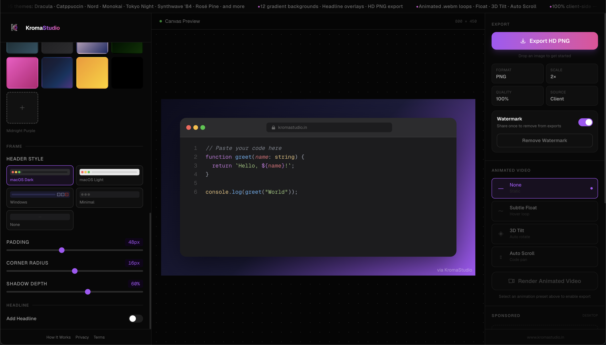
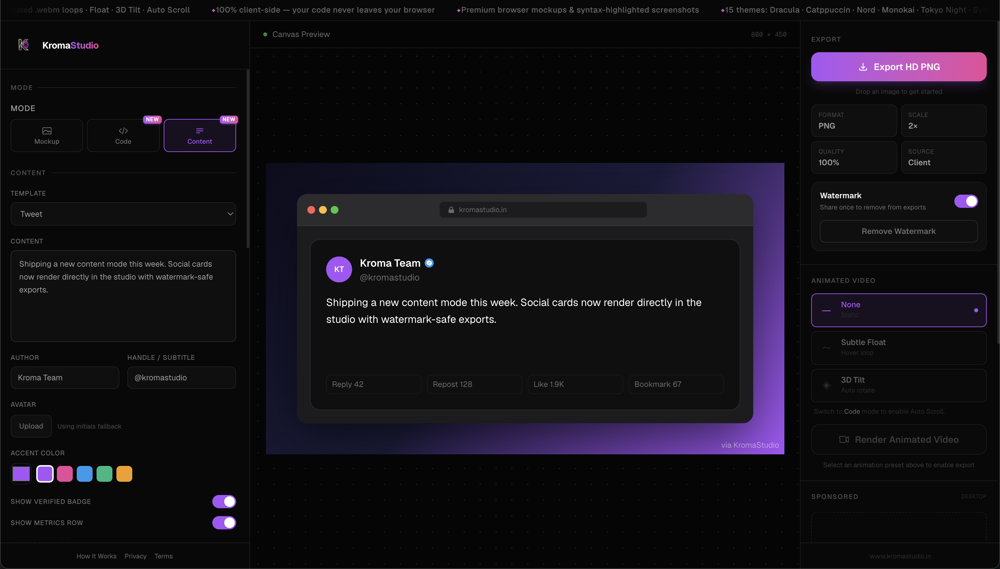

### Mockup Mode

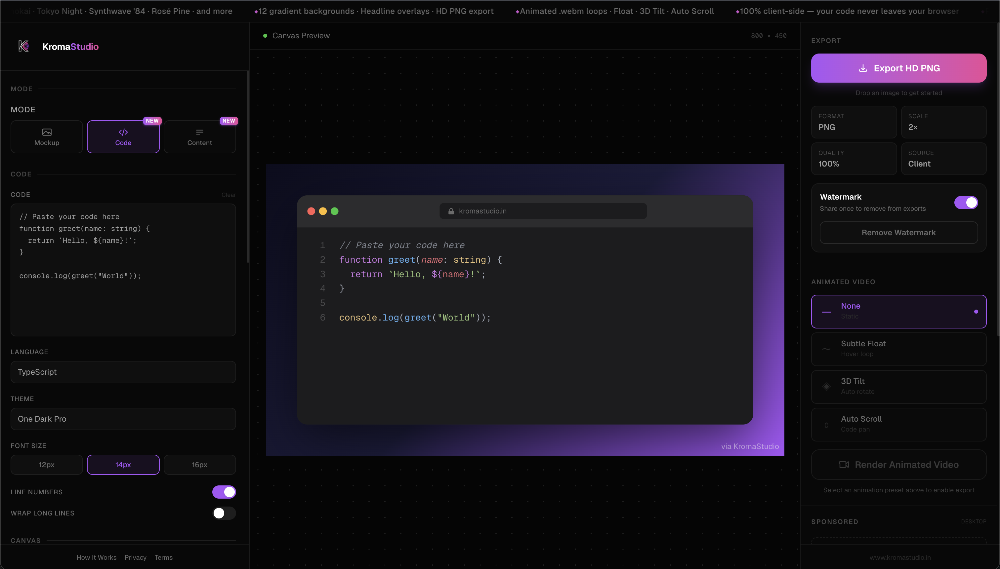
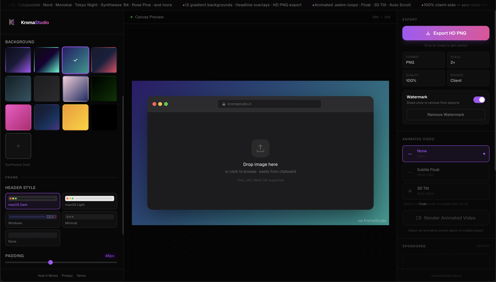

### Content Mode (Social Posts)

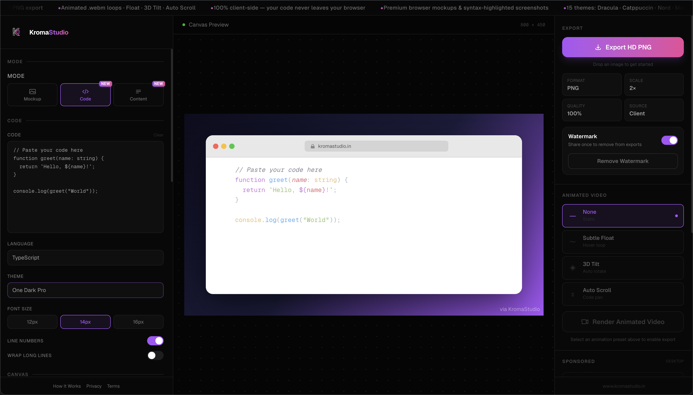
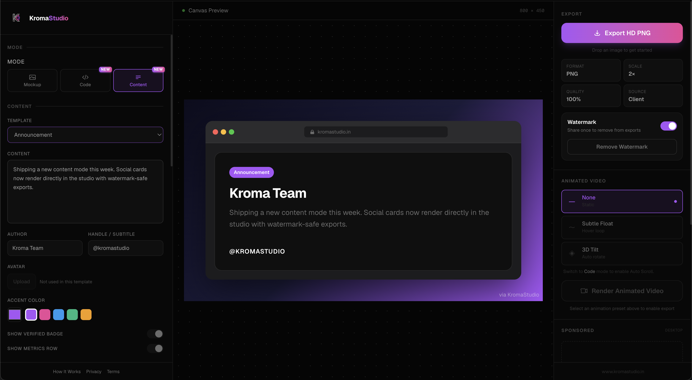

### Theme Picker

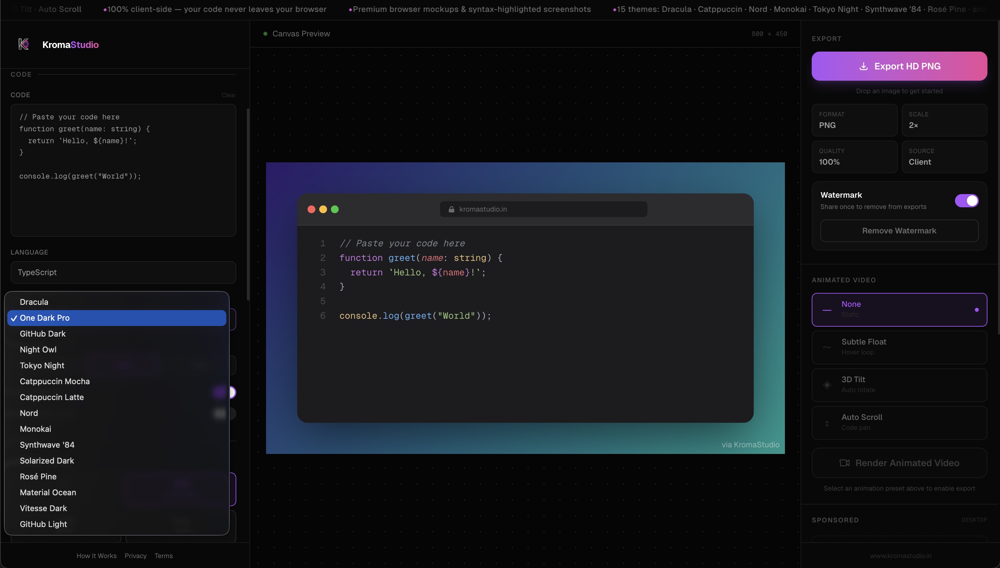

### Gradient Backgrounds

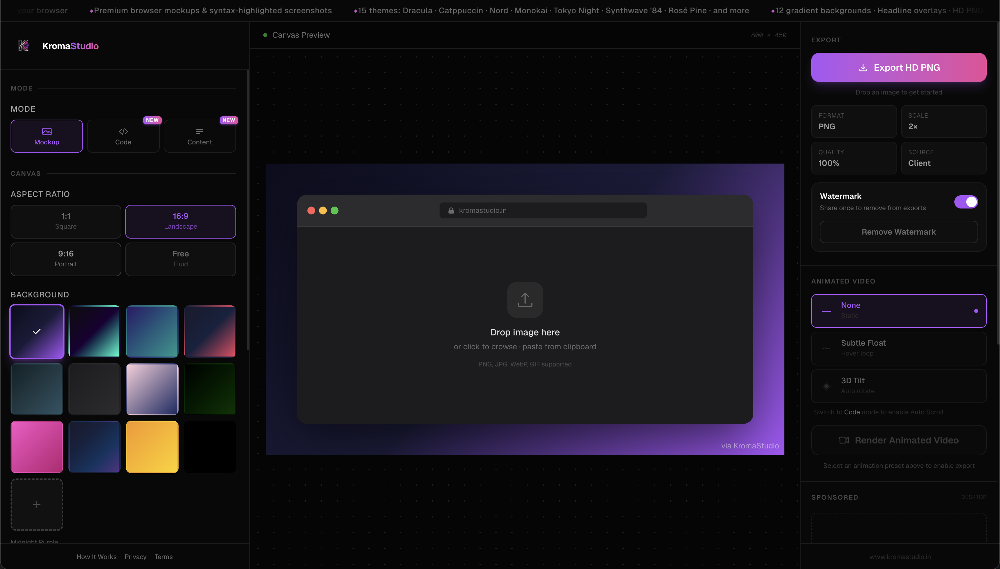

</div>

## Studio Modes

| Mode | What it does |
|------|-------------|
| **Mockup** | Wrap any screenshot in a premium browser frame with gradient background and headline overlay |
| **Code** | Paste code, pick a syntax theme and language, style the frame, export share-ready visuals |
| **Content** | Compose social post cards from 10 templates with avatar, accent colour, metrics, and verified badge |

## Getting Started

### Prerequisites

- Node.js 20+
- npm (or your preferred package manager)

### Installation

```bash
git clone https://github.com/your-org/kroma-studio.git
cd kroma-studio
npm install
```

### Environment variables

Create `.env.local` from the example below. All values use the `NEXT_PUBLIC_` prefix and are intentionally exposed to the browser.

```env
NEXT_PUBLIC_SITE_URL=https://www.kromastudio.in
NEXT_PUBLIC_GOOGLE_SITE_VERIFICATION=

# Google AdSense
NEXT_PUBLIC_ADSENSE_CLIENT=ca-pub-xxxxxxxxxxxx
NEXT_PUBLIC_ADSENSE_SLOT_SIDEBAR_TOP=
NEXT_PUBLIC_ADSENSE_SLOT_SIDEBAR_BOTTOM=
NEXT_PUBLIC_ADSENSE_SLOT_FOOTER=
NEXT_PUBLIC_ADSENSE_SLOT_MOBILE_FOOTER=
NEXT_PUBLIC_ADSENSE_SLOT_RENDERING_OVERLAY=

# Set to true to load real AdSense slots on localhost (layout testing)
NEXT_PUBLIC_ADSENSE_DEV=false
```

> [!NOTE]
> Restart the dev server after changing `.env.local` — Next.js bakes `NEXT_PUBLIC_*` values into the client bundle at build time.

### Run locally

```bash
npm run dev
```

Open [http://localhost:3000](http://localhost:3000) in your browser.

## Available Scripts

| Command | Description |
|---------|-------------|
| `npm run dev` | Start the development server |
| `npm run build` | Production build |
| `npm run start` | Start the production server |
| `npm run lint` | Run ESLint |
| `npm run validate:seo` | Validate all JSON-LD structured data |

## Project Structure

```
app/                    # Next.js App Router pages and API routes
  api/waitlist/         # Waitlist email capture endpoint (Resend)
  browser-mockup-generator/
  code-screenshot-generator/
  content-post-generator/
components/
  canvas/               # Studio canvas renderers (code, mockup, content)
  controls/             # Sidebar controls for each mode
  layout/               # Shell, sidebars, mobile layout
  modals/               # Watermark unlock modal
hooks/
  useExport.ts          # PNG export (html-to-image)
  useVideoRecorder.ts   # Animated .webm export (MediaRecorder, 60 fps)
lib/
  backgrounds.ts        # Gradient preset definitions
  site.ts               # Site-wide constants and SEO metadata
store/
  useStudioStore.ts     # Zustand global state (canvas, code, content, animation)
```

## Tech Stack

| Concern | Library |
|---------|---------|
| Framework | Next.js 16 (App Router) |
| UI | React 19 + Tailwind CSS 4 |
| State | Zustand 5 |
| Syntax highlighting | Shiki 4 |
| Animations | Framer Motion 12 |
| PNG export | html-to-image |
| Video export | MediaRecorder API + Canvas captureStream |
| Email | Resend |
| Analytics | Vercel Analytics + Google Analytics 4 |
| Ads | Google AdSense with auto-refresh |

## SEO & Structured Data

Each tool page ships with JSON-LD structured data and full Open Graph metadata. Validate the JSON-LD locally before deploying:

```bash
npm run validate:seo
```

See [docs/seo-runbook.md](docs/seo-runbook.md) for the full SEO setup guide and manual Google Search Console steps.

## 🤝 Contributing

We welcome contributions — bug reports, feature requests, and pull requests are all appreciated.

### Contribution flow

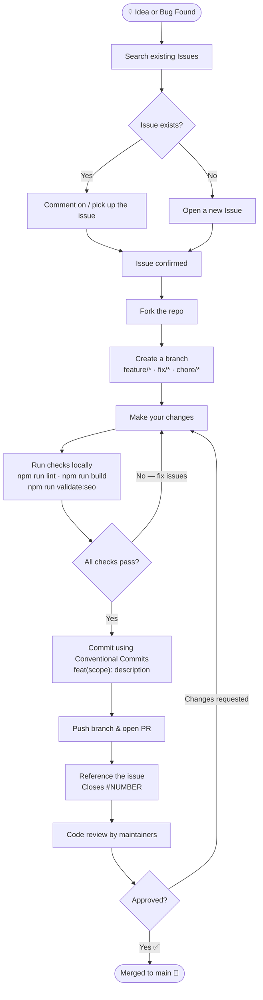

See [CONTRIBUTING.md](CONTRIBUTING.md) for the full guide — branch naming, commit style, PR template, and code conventions.

### Current Contributors

<div align="center">

</div>

## 🎯 Real Use Cases

### 1. GitHub README Badges

Turn raw code into a polished visual that makes your project README stand out.

**Before — plain fenced code block:**
```javascript
function greet(name) {
  console.log(`Hello, ${name}!`);
}
```

**After — paste the same snippet into KromaStudio → pick a theme → export PNG:**

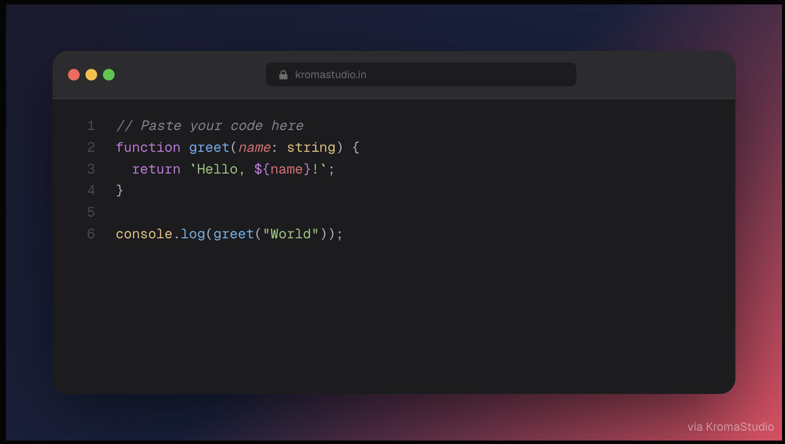

> A syntax-highlighted screenshot with a gradient background and browser frame, dropped straight into your README as an `` tag. No more walls of monochrome text.

---

### 2. Twitter / X Viral Posts

> **[@yourhandle](https://x.com)**
>
> Just shipped `useOptimistic()` in 7 lines of React 19 🔥
>
> _(attach KromaStudio PNG — Dracula theme, Cyberpunk Neon gradient)_
>
> 🔁 847  ❤️ 4.2k  👁️ 120k

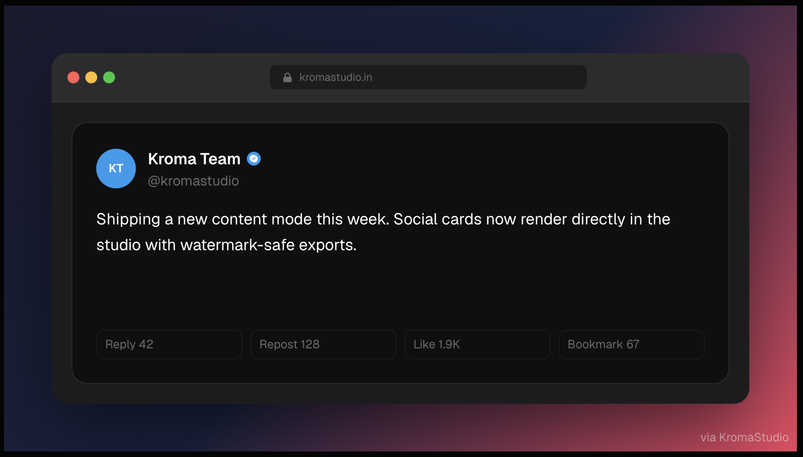

Code screenshots consistently outperform plain text tweets. Export at 2× and attach directly — no cropping needed.

---

### 3. Technical Blog Posts

Use the **Code mode** to produce consistent, on-brand code callouts for every article:

| Blog element | KromaStudio setting |
|---|---|
| Inline snippet highlight | Frameless · 8 px radius · transparent BG |
| Hero banner | Browser frame · gradient BG · headline overlay |
| Step-by-step diffs | Side-by-side exports, same theme |

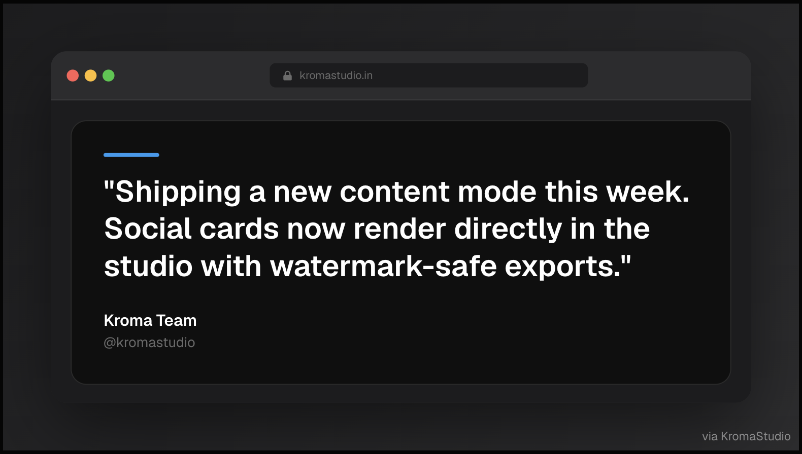

Drop the exported PNGs into Hashnode, Medium, or your own MDX blog — readers immediately know which part to focus on.

---

### 4. LinkedIn Professional Posts

Compose a **Content mode** card with your insight, avatar, and metrics, then attach the code screenshot as a second image. The combination drives 3–5× more impressions than text-only posts.

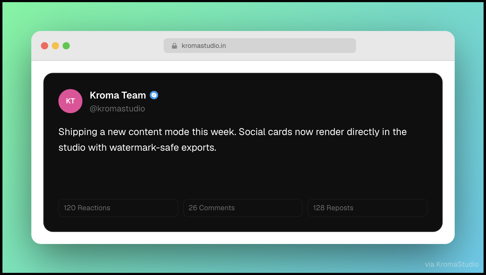

---

### 5. Tutorial Videos & Course Thumbnails

Export a **Mockup mode** frame with the browser chrome and a bold headline overlay — it becomes a ready-made thumbnail that looks consistent across your whole series.

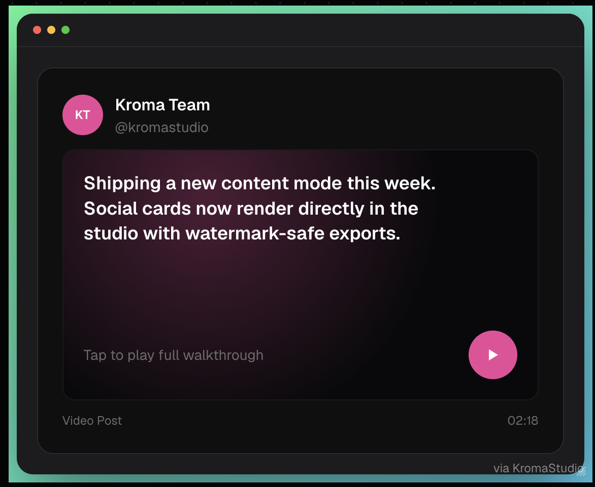

Export at 2× → drop into YouTube Studio, Loom, or Notion. Done.

---

## 🚧 Roadmap

<div align="center">

### Coming Soon

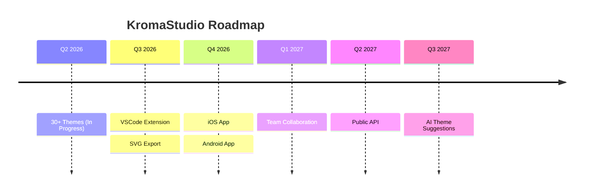

| Feature | Status | ETA |
|---------|--------|-----|
| **VSCode Extension** | 🚧 In Development | Q3 2026 |
| **iOS App** | 📋 Planned | Q4 2026 |
| **Android App** | 📋 Planned | Q4 2026 |
| **30+ Themes** | ✅ In Progress | Now |
| **SVG Export** | 📋 Planned | Q3 2026 |
| **Team Collaboration** | 📋 Planned | Q1 2027 |
| **API** | 📋 Planned | Q2 2027 |
| **AI Theme Suggestions** | 🧪 Research | Q3 2027 |

### Feature Request

Have an idea? [Open an issue](https://github.com/your-org/kroma-studio/issues) to suggest a feature!

</div>

## Deployment

The project is optimised for [Vercel](https://vercel.com). Set all `NEXT_PUBLIC_*` environment variables in the Vercel dashboard before deploying.

> [!TIP]
> The `kromastudio.in` apex domain is permanently redirected to `www.kromastudio.in` via a `next.config.ts` redirect rule — make sure your DNS points the `www` subdomain to Vercel.

You can check out [the Next.js GitHub repository](https://github.com/vercel/next.js) - your feedback and contributions are welcome!

## Deploy on Vercel

The easiest way to deploy your Next.js app is to use the [Vercel Platform](https://vercel.com/new?utm_medium=default-template&filter=next.js&utm_source=create-next-app&utm_campaign=create-next-app-readme) from the creators of Next.js.

Check out our [Next.js deployment documentation](https://nextjs.org/docs/app/building-your-application/deploying) for more details.
