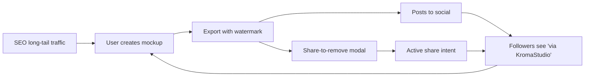

# KromaStudio — Product Analysis Report

**Framework applied:** Product Strategy Canvas + Lean Canvas + Outcome Roadmap Assessment  
**Date:** May 27, 2026  
**Repo:** `kroma-studio` (v0.1.0)  
**Live domain:** [kromastudio.in](https://kromastudio.in)

---

## Executive Summary

KromaStudio is a **free, client-side browser tool** that turns code snippets, screenshots, and (planned) social content into aesthetic mockups and animated video loops. It targets developers, indie hackers, and content creators who need scroll-stopping visuals for X/Twitter, LinkedIn, and Reels — without sign-up, upload, or desktop software.

The product is **~80% through a deliberate 5-phase launch plan**. Phases 1–4 are shipped on `main`; Phase 5 (Content Mode) is spec'd but not built. The core differentiator — **client-side animated `.webm` export** — is live and rare among free competitors.

**Strategic position:** SEO-driven PLG utility with ad monetization and honor-system viral loops. Not a SaaS subscription play today.

---

## Product Vision & Value Proposition

| Element | Definition |
|---------|------------|
| **Problem** | Developers and creators post ugly raw screenshots. Existing beautifiers are paywalled, require accounts, or lack motion export. |
| **Solution** | Instant aesthetic mockups + syntax-highlighted code cards + looping video — all in-browser, zero friction. |
| **UVP** | "Paste code → get a stunning card. Animate it. Export HD PNG or `.webm`. Free, no sign-up, 100% client-side." |
| **Anti-positioning** | Not Figma. Not a design suite. Not cloud storage. A single-purpose viral content factory. |

---

## What's Shipped (Implementation vs. Plan)

### Phase 1 — Core Mockup Studio ✅
- Image upload (drag-and-drop) inside browser chrome frames
- 12 gradient background presets + custom two-color gradient
- Chrome styles: macOS Dark/Light, Windows, Minimal, None
- Padding, border radius, shadow depth controls
- Aspect ratios: 1:1, 16:9, 9:16, free
- HD PNG export at 2× (1.5× on mobile to prevent Safari OOM)
- iOS long-press export modal (Safari download workaround)
- Subtle "via KromaStudio" watermark

### Phase 2 — Code Mode & Headlines ✅
- Three-mode selector: Mockup | Code | Content (Content = teaser only)
- Shiki syntax highlighting: TS, JS, Python, HTML, CSS, Go, Rust
- 5 themes: Dracula, One Dark Pro, GitHub Dark, Night Owl, Tokyo Night
- Line numbers, font size, wrap toggle
- Optional headline overlay (contentEditable) for viral hook text

### Phase 3 — Animation & Video Export ✅
- Framer Motion presets: Float, 3D Tilt, Auto-Scroll (code mode)
- Client-side MediaRecorder → `.webm` at 60fps, VP9, 2× Retina capture
- Rendering overlay with progress bar during encode
- PWA manifest, mobile parity, error boundaries
- Safari explicitly unsupported for video (documented in UI)

### Phase 4 — Monetization & Virality ✅
- Google AdSense: sidebar top/bottom, footer, mobile footer, rendering overlay
- Auto-refresh ads every 45s (`useAutoRefreshAds`)
- Share-to-remove watermark modal (X + LinkedIn, honor system)
- Branded export filenames: `kromastudio-{timestamp}.png/.webm`
- Full SEO stack: OG tags, JSON-LD, robots.ts, sitemap.ts, sr-only H1/H2

### Phase 5 — Content Mode ❌ Not Started
- Tweet, quote, announcement, testimonial card templates
- Spec complete in `phases/PHASE-5.md`
- Currently: SOON badge + email capture popover on Content tab click

---

## Architecture Snapshot

```
Next.js 16 (App Router) + React 19 + Zustand + Tailwind 4
├── Client-side only for core value (no image upload to server)
├── html-to-image → PNG export
├── MediaRecorder + html-to-image rAF loop → WebM export
├── shiki → WASM syntax highlighting
├── framer-motion → animation presets
├── Resend API → waitlist email notifications only
└── Vercel Analytics + GA4 dual tracking
```

**Key design decision:** Everything creative happens in `#studio-canvas` DOM — PNG and WebM both snapshot the same node. New modes (Content) plug into this pattern with minimal export changes.

---

## Target Users (ICP)

| Segment | Job-to-be-Done | Why KromaStudio Wins |
|---------|------------------|----------------------|
| **Indie dev / builder** | Share code wins on X/LinkedIn | Code mode + headline overlay + free |
| **Dev educator / YouTuber** | Thumbnails and B-roll loops | Animated scroll + 16:9 export |
| **Startup marketer** | Product screenshots that look premium | Browser mockup + gradients |
| **Content creator** | Reels/TikTok motion assets | `.webm` loops, 9:16 aspect ratio |

**Beachhead:** Developer Twitter/X — high sharing velocity, low willingness to pay, high ad-impression tolerance.

---

## Competitive Landscape

| Competitor | Strength vs. KromaStudio | KromaStudio Edge |
|------------|--------------------------|------------------|
| **Ray.so / Carbon** | Mature code beautifier | Browser frames, animation, mockup mode |
| **Screenshot.one / Pika** | API/automation | Free, no API key, instant browser UX |
| **Canva / Figma** | Full design suite | Zero learning curve, code-native |
| **CleanShot X** (Mac) | Pro screenshot tool | Cross-platform, free, web-native |

**Moat assessment:** Weak technical moat (client-side is copyable). Moat = **SEO long-tail keywords + brand watermark virality + animation UX polish + speed to first export**.

---

## Business Model

| Revenue Stream | Status | Notes |
|----------------|--------|-------|
| **Google AdSense** | Live (prod) | 5 zones including high-attention rendering overlay |
| **Ezoic migration** | Planned in docs | Higher RPM alternative mentioned in Phase 4 spec |
| **Subscriptions** | None | Intentionally free — frictionless PLG |
| **Freemium watermark removal** | Viral, not revenue | Share-to-remove drives acquisition |

**Unit economics hypothesis:** High traffic × low RPM display ads + viral coefficient from watermarks/shares. Break-even depends on organic SEO traction, not conversion funnels.

---

## Growth Loops (Implemented)



1. **Passive watermark loop** — every export promotes brand
2. **Active share loop** — watermark removal gated by social share (honor system)
3. **SEO loop** — 18+ targeted keywords, JSON-LD, semantic headings
4. **Waitlist loop** — Content mode teaser captures emails for Phase 5 launch

---

## Analytics Instrumentation

Dual pipeline: **Vercel Analytics + GA4** (`lib/analytics.ts`).

| Event Category | Key Events |
|----------------|------------|
| Mode & content | `mode_click`, `background_change`, `chrome_style_change` |
| Export | `export_png_click`, `video_record_start/complete/error` |
| Virality | `watermark_modal_open`, `share_intent_clicked` |
| Lead gen | `waitlist_signup`, `email_capture_dismiss` |
| Reliability | `canvas_error`, `app_error` |

**Gap:** No funnel dashboard defined. No North Star metric documented in repo. Recommended North Star: **weekly unique exports** (PNG + WebM).

---

## Roadmap Status

| Phase | Theme | Status | Branch |
|-------|-------|--------|--------|
| 1 | Core mockup studio | ✅ Shipped | merged |
| 2 | Code mode + headlines | ✅ Shipped | `phase-2` → main |
| 3 | Animation + video | ✅ Shipped | `phase-3` → main |
| 4 | Ads + watermark virality | ✅ Shipped | `phase-4` → main |
| 5 | Content mode (tweets, quotes) | 📋 Spec only | — |

**Current version:** 0.1.0 — pre-1.0, post-monetization-launch.

---

## SWOT Summary

| Strengths | Weaknesses |
|-----------|------------|
| Zero-friction UX (no sign-up) | Single-page app — limited SEO surface area |
| Unique free animated video export | Safari video unsupported |
| Strong mobile parity | Honor-system share unlock is unverifiable |
| Comprehensive event tracking | No user accounts = no retention data |
| Phase docs show disciplined execution | Content mode gap vs. "tweet screenshot maker" SEO keyword |

| Opportunities | Threats |
|---------------|---------|
| Phase 5 unlocks tweet/quote market | Ray.so adds animation |
| Programmatic SEO landing pages per language/theme | Ad blockers reduce RPM |
| Chrome extension for one-click beautify | Google AdSense policy/rejection risk |
| Premium tier (no watermark, 4K, MP4) | LLM tools generate visuals inline |

---

## Prioritized Recommendations

### P0 — Ship Phase 5 (Content Mode)
Highest ROI next step. SEO already targets "tweet screenshot maker"; Content tab teases the feature but delivers nothing. Unlocking it converts existing waitlist interest and completes the three-mode promise.

### P1 — Define & Track North Star Metric
Add a weekly exports dashboard (GA4 custom event or Vercel). Segment by mode, source (mobile/desktop), and export type (PNG vs WebM).

### P2 — Safari Video Path
Safari is ~20%+ of dev traffic. Options: server-side ffmpeg transcode (adds cost) or document + promote PNG-only on Safari with clear UX.

### P3 — SEO Expansion Beyond Single Page
Create `/code-screenshot-maker`, `/browser-mockup-generator` landing pages or programmatic `[language]-code-screenshot` pages to expand indexable surface.

### P4 — Monetization Optimization
- A/B test rendering overlay ad size/placement
- Evaluate Ezoic migration once traffic threshold hit
- Consider optional "tip jar" or Ko-fi for goodwill revenue without paywalling core features

### P5 — Retention Hook (Lightweight)
LocalStorage project history (last 3 mockups) — no account required, increases return visits.

---

## Key Metrics to Watch

| Metric | Type | Why |
|--------|------|-----|
| Weekly unique exports | North Star | Core value delivery |
| Export rate (sessions → export) | Activation | Product-market fit signal |
| Share intent click rate | Viral coefficient | Watermark loop effectiveness |
| Waitlist signups (Content mode) | Demand validation | Phase 5 launch audience |
| Ad RPM × pageviews | Revenue | Monetization health |
| Organic search impressions | Acquisition | SEO blueprint ROI |
| Video record completion rate | Feature adoption | Differentiator usage |

---

## Conclusion

KromaStudio is a well-scoped, execution-disciplined **free utility product** with a clear path from mockup tool → viral content factory. The codebase reflects intentional phasing, strong mobile/web parity, and monetization readiness. The biggest product gap is **Phase 5 Content Mode**, which blocks a meaningful SEO keyword cluster and leaves a visible "SOON" promise unfulfilled.

The strategic bet is correct for this category: **maximize reach and exports, monetize via ads and virality, defer subscriptions until traffic proves demand.**

---

*Generated from repo analysis: codebase, phase docs, git history, and live metadata configuration.*
