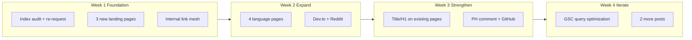

# KromaStudio 30-Day SEO Ranking Plan

## Realistic expectations (15 vs 30 days)

Based on prior SERP research and current codebase state:

| Timeline       | Achievable                                                                                                                   | Unlikely in this window                                          |
| -------------- | ---------------------------------------------------------------------------------------------------------------------------- | ---------------------------------------------------------------- |
| **Days 1–15**  | New pages indexed; long-tail terms start appearing in GSC; strengthen existing #1–#2 positions                               | Page 1 for "free code screenshot generator"                      |
| **Days 16–30** | Page 1 for niche terms (animated webm, snappify alt, privacy, language pages); alternative pages enter top 10 with backlinks | Beat Carbon/Ray.so on head terms without sustained link building |

**Current wins to protect and expand:**

- `#1` macos browser mockup → expand to chrome/windows/browser frame variants
- `#2` code mockup generator + animated webm → dedicated landing pages + Dev.to content

## Live site + GSC status (verified June 2026)

**GSC sitemap (your screenshot — confirmed):**
- `https://www.kromastudio.in/sitemap.xml` — **Status: Success**
- Submitted May 31 · Last read Jun 5
- **Discovered pages: 10** — matches exactly the 10 URLs in `PUBLIC_ROUTES` ([lib/site.ts](lib/site.ts)): homepage + 9 routes

| # | URL in sitemap |
|---|----------------|
| 1 | `/` |
| 2 | `/code-screenshot-generator` |
| 3 | `/browser-mockup-generator` |
| 4 | `/content-post-generator` |
| 5 | `/how-it-works` |
| 6 | `/ray-so-alternative` |
| 7 | `/carbon-alternative` |
| 8 | `/github-kroma-studio` |
| 9 | `/privacy` |
| 10 | `/terms` |

**Foundation is solid:** Sitemap Success, Google discovered all 10 sitemap URLs.

**Page indexing (your screenshot — Jun 6 baseline):**

| Status | Count | Notes |
|--------|-------|-------|
| **Indexed** | **8** | Can appear in search |
| **Not indexed** | **6** | 2 reasons — click grey box in GSC to see exact labels |
| **Total discovered** | **14** | 10 sitemap URLs + extras (e.g. `favicon.ico`, assets) |

**Known not-indexed examples (crawled May 31):**
- `/carbon-alternative` — **high SEO value**, rich page but Google chose not to index yet (new site authority)
- `/github-kroma-studio` — **thin page** (~120 lines, no FAQ/JSON-LD) — likely fixable by expanding content
- `/favicon.ico` — **ignore** — should not be indexed; not a problem

**Likely indexed (8):** homepage, `/code-screenshot-generator`, `/browser-mockup-generator`, `/how-it-works`, `/ray-so-alternative` or `/content-post-generator`, `/privacy`, `/terms`, plus others — confirm in GSC → Pages → Indexed filter.

**Chart insight:** Indexing only started late May — site is ~1 week old in Google's eyes. Ranking takes longer than indexing; fixing the 6 not-indexed pages is Week 1 priority before shipping new pages.

**Week 1 P0 (updated):** (1) Fix not-indexed high-value pages, (2) then ship new landing pages + off-page.

---

## Week 1 (Days 1–7): Indexing gaps + highest-ROI pages

### 1.0 GSC indexing fix (manual + code, Day 1–3) — do this BEFORE new pages

**Step 1 — Identify the 2 reasons (Day 1, 5 min):**
- GSC → Page indexing → click grey **"Not indexed · 6 · 2 reasons"** box
- Note exact labels (usually mix of "Crawled – currently not indexed" + "Discovered – currently not indexed")

**Step 2 — Request indexing for high-value URLs (Day 1):**
- `/carbon-alternative` — crawled May 31, not indexed; URL Inspection → **Request indexing**
- `/github-kroma-studio` — same
- Repeat for any other marketing URLs in the not-indexed list (check `/ray-so-alternative`, `/content-post-generator`)

**Step 3 — Fix thin content (Day 2–3, code):**
- Expand [app/github-kroma-studio/page.tsx](app/github-kroma-studio/page.tsx): self-host steps, tech stack table, FAQ (5+ questions), JSON-LD FAQPage — mirror landing page depth
- For `/carbon-alternative`: already rich — add more internal links FROM indexed pages (homepage footer, code-screenshot landing) pointing to it; request indexing again after deploy

**Step 4 — Ignore noise:**
- `favicon.ico` in not-indexed list is normal — no action needed

**Step 5 — Baseline metrics (Day 1):**
- GSC → **Performance** → note current impressions/clicks (likely near zero — site is ~1 week old)

**Success signal (Day 7):** Not indexed drops from 6 → 2 or fewer; `/carbon-alternative` shows as Indexed.

### 1.0b Optional sitemap hardening (code, low priority)

If `/sitemap.xml` ever 500s again, remove runtime `execSync` in [app/sitemap.ts](app/sitemap.ts). Not blocking — GSC last read Jun 5 successfully.

### 1.1 Ship 3 new landing pages (code, Days 2–5)

Reuse the proven pattern: `lib/landing/*.ts` content + `app/*/page.tsx` + `createLandingMetadata()` + JSON-LD in [lib/json-ld.ts](lib/json-ld.ts) + register in [lib/site.ts](lib/site.ts) `PUBLIC_ROUTES` and `ROUTE_ANALYTICS`.

| Page                                | Target keyword                        | Why now                                                                              |
| ----------------------------------- | ------------------------------------- | ------------------------------------------------------------------------------------ |
| `/snappify-alternative`             | snappify alternative                  | Keyword in [app/layout.tsx](app/layout.tsx) but **no page**; Snappify owns listicles |
| `/secure-code-screenshot-generator` | client side code screenshot / privacy | Noserver #1; you have USP but no dedicated page                                      |
| `/animated-code-screenshot`         | animated code screenshot webm         | Already rank #2; own this term with focused page                                     |

**Implementation notes:**

- Copy structure from [app/ray-so-alternative/page.tsx](app/ray-so-alternative/page.tsx) + [lib/landing/ray-so-alternative.ts](lib/landing/ray-so-alternative.ts)
- Snappify page: reuse `OTHER_ALTERNATIVES` from [lib/landing/carbon-alternative.ts](lib/landing/carbon-alternative.ts); add `COMPARISON_ROWS` (Snappify vs KromaStudio) emphasizing **free .webm**, **no paywall**, **all-in-one**
- Privacy page: feature comparison table like BytePane/Noserver (Carbon/Ray.so server-side vs KromaStudio client-side); link to `/privacy` for policy details
- Animated page: HowTo schema (Float → 3D Tilt → Auto Scroll → export .webm); FAQ about Safari limitation

Add to [components/layout/LandingShell.tsx](components/layout/LandingShell.tsx) footer `FOOTER_SECONDARY_LINKS`:

- vs Snappify
- Secure / client-side (short label)

### 1.2 Internal linking pass (Day 6–7)

Strengthen crawl paths and topical authority:

- [app/code-screenshot-generator/page.tsx](app/code-screenshot-generator/page.tsx) → link to new animated + privacy pages
- [app/browser-mockup-generator/page.tsx](app/browser-mockup-generator/page.tsx) → link to animated page
- [app/how-it-works/page.tsx](app/how-it-works/page.tsx) → link to all 3 new pages
- Existing comparison pages → cross-link snappify + privacy pages in "Other alternatives" sections

---

## Week 2 (Days 8–14): Programmatic language pages + first off-page wave

### 2.1 Ship 4 language landing pages (Days 8–11)

Target queries where competition is weaker than head terms:

| Page                          | Keyword                          |
| ----------------------------- | -------------------------------- |
| `/python-code-screenshot`     | python code screenshot generator |
| `/typescript-code-screenshot` | typescript code screenshot       |
| `/javascript-code-screenshot` | javascript code screenshot       |
| `/java-code-screenshot`       | java code screenshot             |

**Efficient approach (avoid 4 copy-paste pages):**

- Create shared types + factory in `lib/landing/language-code-screenshot.ts` (language name, example snippet, use cases, FAQ)
- Single reusable page component or thin `app/[lang]-code-screenshot/page.tsx` — **prefer static routes first** (4 files) for simpler sitemap/JSON-LD; refactor to dynamic route only if you add 10+ languages later
- Each page: language-specific example code block, "Open studio in Code mode" CTA with pre-selected language if store supports URL param (optional enhancement: `/?mode=code&lang=python`)

Register all 4 in `PUBLIC_ROUTES`, `LANDING_PAGE_META`, `ROUTE_ANALYTICS`.

### 2.2 Off-page wave 1 (Days 10–14)

| Channel              | Content angle                                                  | Link target                         |
| -------------------- | -------------------------------------------------------------- | ----------------------------------- |
| **Dev.to**           | "Free animated code screenshots in browser (.webm, no signup)" | `/animated-code-screenshot` + `/`   |
| **Reddit r/webdev**  | Show before/after + privacy angle                              | `/secure-code-screenshot-generator` |
| **Reddit r/reactjs** | Open-source Next.js + client-side export stack                 | `/github-kroma-studio`              |

Rules: genuine value, demo GIF, no spam; 1 post per subreddit max in week 2.

### 2.3 Request indexing again (Day 14)

GSC URL Inspection for all 7 new URLs from weeks 1–2.

---

## Week 3 (Days 15–21): Optimize existing pages + off-page wave 2

### 3.1 On-page optimization for pages that exist but don't rank (Days 15–17)

**Problem:** [app/code-screenshot-generator/page.tsx](app/code-screenshot-generator/page.tsx) H1 is "Free Code Screenshot Generator" but you don't rank for that head term — competitors (Code to Image, Code Snapshot) have longer FAQ + comparison content.

Changes (minimal, high impact):

- Add **"KromaStudio vs Carbon vs Ray.so"** comparison section to code-screenshot landing (reuse rows from carbon/ray libs, condensed table)
- Expand FAQ in [lib/landing/code-screenshot-generator.ts](lib/landing/code-screenshot-generator.ts) with privacy + animation questions (mirror BytePane/Noserver wording)
- Update meta title in [lib/site.ts](lib/site.ts) `LANDING_PAGE_META.codeScreenshot` to lead with exact query: `"Free Code Screenshot Generator Online — No Sign-Up | KromaStudio"`

**Alternative pages** ([app/ray-so-alternative/page.tsx](app/ray-so-alternative/page.tsx), [app/carbon-alternative/page.tsx](app/carbon-alternative/page.tsx)):

- Add prominent **3-column comparison table** at top (Feature | Competitor | KromaStudio) — BytePane ranks partly because of this format
- Ensure H1 includes exact query: "Ray.so Alternative" / "Carbon.now.sh Alternative" (already close; verify title/H1 alignment)

### 3.2 Browser mockup keyword expansion (Day 17–18)

You rank #1 for macOS — capture adjacent terms on existing page:

- Add H2 sections in [lib/landing/browser-mockup-generator.ts](lib/landing/browser-mockup-generator.ts): "Chrome browser mockup", "Safari mockup generator", "Windows browser frame"
- Add FAQ entries for each frame type (content only, no new routes needed)

### 3.3 Off-page wave 2 (Days 18–21)

| Channel           | Content                                                                                        | Link                                                                  |
| ----------------- | ---------------------------------------------------------------------------------------------- | --------------------------------------------------------------------- |
| **Product Hunt**  | Comment on related tools + maker story update (PH badge already in [lib/site.ts](lib/site.ts)) | `/`                                                                   |
| **GitHub README** | Add "Alternatives" section linking to comparison pages                                         | `/ray-so-alternative`, `/carbon-alternative`, `/snappify-alternative` |
| **Dev.to #2**     | "Snappify alternative that's free" or Python screenshot tutorial                               | `/snappify-alternative` or `/python-code-screenshot`                  |
| **LinkedIn/X**    | Short demo clip of .webm export                                                                | `/animated-code-screenshot`                                           |

---

## Week 4 (Days 22–30): GSC-driven iteration + consolidation

### 4.1 Weekly GSC review ritual (Days 22, 29)

From [docs/seo-runbook.md](docs/seo-runbook.md) monitoring table:

- **Queries with impressions but low CTR** → rewrite title/description in `LANDING_PAGE_META`
- **Queries with avg position 8–20** → add FAQ question matching exact query on relevant page
- **Pages not indexed** → expand content (aim 800+ words on comparison pages), add internal links

### 4.2 Ship 2 more pages based on GSC data (Days 23–26)

Default if GSC data not ready yet:

| Page                               | Keyword                                      |
| ---------------------------------- | -------------------------------------------- |
| `/chrome-browser-mockup-generator` | chrome browser mockup generator              |
| `/free-code-screenshot-maker`      | code screenshot maker free (synonym capture) |

Only build `/free-code-screenshot-maker` if it won't cannibalize `/code-screenshot-generator` — use canonical to main page OR make it a shorter alias page with unique FAQ; **prefer expanding main page** unless GSC shows distinct query cluster.

### 4.3 Off-page wave 3 (Days 27–30)

- **Hacker News Show HN** (optional, high risk/reward) — client-side + open source angle
- **Indie Hackers** post — building in public + SEO strategy
- Comment on existing Dev.to/Medium "Carbon alternatives" articles with helpful comparison (not spam)

### 4.4 Do NOT do in 30 days

- Multilingual / hreflang pages (low ROI vs English long-tail)
- Tweet URL-paste feature (needed for "tweet screenshot maker" but large product scope)
- Full dynamic `[language]-code-screenshot` for all 25 languages (ship 4 first, measure)

---

## Files to touch (summary)

| Action              | Files                                                                                                                                                                    |
| ------------------- | ------------------------------------------------------------------------------------------------------------------------------------------------------------------------ |
| New landing content | `lib/landing/snappify-alternative.ts`, `secure-code-screenshot.ts`, `animated-code-screenshot.ts`, `language-code-screenshot.ts`                                         |
| New routes          | `app/snappify-alternative/page.tsx`, etc.                                                                                                                                |
| Site registry       | [lib/site.ts](lib/site.ts) — `LANDING_PAGE_META`, `PUBLIC_ROUTES`, `ROUTE_ANALYTICS`                                                                                     |
| Schema              | [lib/json-ld.ts](lib/json-ld.ts) — FAQPage + HowTo for new pages                                                                                                         |
| Navigation          | [components/layout/LandingShell.tsx](components/layout/LandingShell.tsx)                                                                                                 |
| Optimize existing   | [lib/landing/code-screenshot-generator.ts](lib/landing/code-screenshot-generator.ts), [lib/landing/browser-mockup-generator.ts](lib/landing/browser-mockup-generator.ts) |

---

## Success metrics (track weekly in GSC)

| Metric                                                        | Day 15 target             | Day 30 target  |
| ------------------------------------------------------------- | ------------------------- | -------------- |
| Indexed pages                                                 | 12+                       | 18+            |
| Total impressions/week                                        | 50+                       | 300+           |
| Page 1 keywords                                               | 3–4 (existing + animated) | 8–12 long-tail |
| Avg position (animated webm, snappify alt, python screenshot) | Top 20                    | Top 5          |
| Referral sessions (Dev.to, Reddit)                            | 20+                       | 100+           |

---

## Recommended build order (if implementing in code)

1. `/snappify-alternative` — fastest win, page missing today
2. `/animated-code-screenshot` — reinforce existing #2 rank
3. `/secure-code-screenshot-generator` — privacy gap vs Noserver
4. `/python-code-screenshot` + `/typescript-code-screenshot` — programmatic template proof
5. Optimize `/code-screenshot-generator` comparison section
6. Remaining language pages + chrome mockup page

Off-page posts should go live **within 48 hours of each page batch** so Google sees backlinks during crawl.
